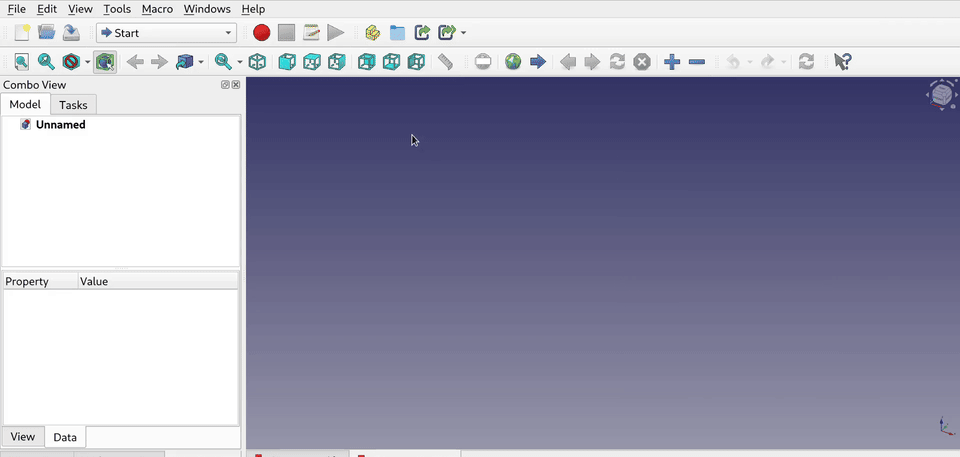
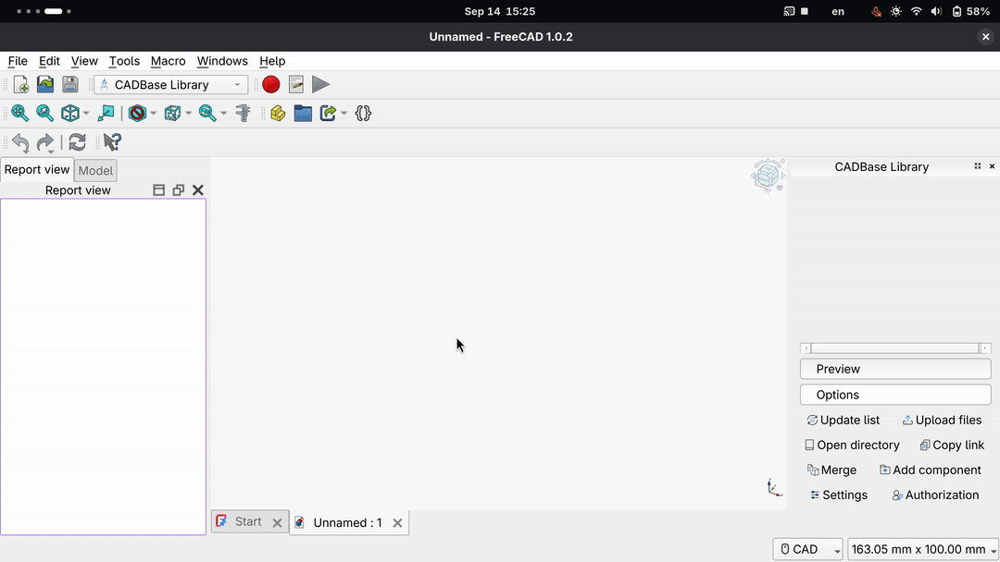
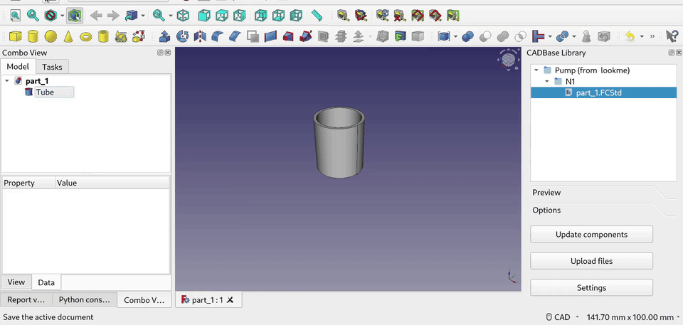

# Workbench Cadbase Library

[](https://www.gnu.org/licenses/lgpl-3.0)
[](https://www.freecad.org)

This workbench allows the user to interact with CADBase (upload and download parts) via the FreeCAD interface.

CADBase is a platform for publishing and sharing information about 3D components, drawings and manufacturers.

**Important Note:**  To use the workbench, you must have an account on the [CADBase Platform](https://cadbase.rs).

## Description

The workbench is designed to use components (parts) from CADBase in the FreeCAD interface.

Component modifications contain sets of files for various CAD systems. This workbench will work with data from the FreeCAD set, without downloading documentation and data from other file sets.

Files uploaded to file sets are versioned, allowing you to restore earlier versions, get the old state they were in before the changes, review the changes, and find out who last changed something and caused the problem.

 version and then returning the first version.")

## Install

### Addon Manager (recommended)

CADBaseLibrary is available through the FreeCAD Addon Manager:

It is called _CADBaseLibrary_ in the Addon Repository.

In menu **Tools** select **Addon Manager**, select the **Workbenches** tab find _CADBaseLibrary_ in the list and click Install.

**Important Note:** CADBaseLibrary needs FreeCAD v0.19 or above. CADBaseLibrary is **not** compatible with FreeCAD v0.18 and before.

### Manual Installation

It is also possible to install this workspace manually into FreeCAD's local Mod directory. This can be useful for testing local modifications to the workspace, or to remove an old stale version of the workspace.

In this case, download the Github [cadbaselibrary-freecad-master.zip](https://github.com/mnnxp/cadbaselibrary-freecad/archive/master.zip) archive from [github.com/mnnxp/cadbaselibrary-freecad](https://github.com/mnnxp/cadbaselibrary-freecad) (see [Links](#Links) for more) to a temporary directory, and extract the Zip archive. Delete (or move) the **CadbaseLibrary** directory from the local FreeCAD Mod directory, if it exists. Then copy all items in the **cadbaselibrary-freecad** folder to the **CadbaseLibrary** folder in the directory containing all FreeCAD addon workspaces:

* for Windows: `C:\Users\******\AppData\Roaming\FreeCAD\Mod`
* for MacOS: `~/Library/Preferences/FreeCAD/Mod/`
* for Linux, _FreeCAD version v0.19_ : `~/.FreeCAD/Mod`
* for Linux, _FreeCAD version v0.20_ : `~/.local/share/FreeCAD/Mod/`

Below is a method for those who like to install manually, but in a shorter way:
```sh
# Example for the Linux platform and FreeCAD versions above v0.20
git clone https://gitlab.com/cadbase/cadbaselibrary-freecad.git \
~/.local/share/FreeCAD/Mod/CadbaseLibrary/
```

**Please Note:** You can see the current mod folder path through the Python console in FreeCAD. The method is described in the [additional section](#freeecad-modules-and-macros-folders).

### Dependencies

##### Installation Blake3

To use this workbench to update files already in the CADBase storage, Blake3 must be installed.

```sh
  # Install on Unix/macOS
  python3 -m pip install "blake3"
  # Install on Windows
  py -m pip install "blake3"
```

**Please Note:** The workbench will work without this _Blake3_ library, the only difference is that the files in the CADBase storage (cloud) that have already been uploaded will not be replaced.

### First start

After it is installed and restart FreeCAD, the workbench will be available in the workbench drop-down list.

Select the **CADBase Library** workbench from the workbench drop-down list.

On first run, the workbench will ask you for the location of your library. The CADBase cloud storage will be synchronized with this location, and technical files for the workbench will be created there.

This location can be changed in the workbench settings in the field _Library path_.

#### Getting an authorization token

In the _CADBase library_ window, on the **Options** tab, click the **Settings** button.

When the _CADBase library configuration_ window opens, you need to set a **username** and **password** in order to access CADBase.

After entering these data to receive the token and pressing the **OK** button. Please wait until you receive the token.



**Important Note:**  If the access token has expired, you need to repeat the steps above.

## Usage

Add target components to bookmarks (favorites) on the CADBase site.

")

In FreeCAD will only display components that the user has bookmarked on CADBase, as well as those that have been previously downloaded.

### Getting data

Clicking **Update components** only updates the list of components from bookmarks active user, without downloading component modifications and files.

Double-clicking on a components folder to get a list of modifications for component.

Getting files of a fileset for FreeCAD occurs after double-clicking on a modification folder.



### Sending data

Select the modification from which you want to upload files.

Click the **Upload files** button for upload local files of select modification folder to CADBase storage (cloud).

Information about the upload process will be displayed in the log.

After uploading the files, a message will be displayed in the log with information about the number of successfully uploaded files.



## Additional Information

##### FreeCAD modules and macros folders

In FreeCAD, you can find your user _modules folder_ by typing or pasting `App.getUserAppDataDir()+"Mod"` and the user _macros folder_ by typing `App.getUserMacroDir()` in the Python console (found under View->Panels menu).

##### Used (reserved) names in the workbench

Please don't use `cadbase_file_2018` and `cadbase_file_2018.log` as file or folder names in the CADBase library folder. These files store server responses and logs, if you use these filenames for your data, you may lose them.

If you need to save logs to a file (for example, for debugging, studying, or other purposes), you need to create a _cadbase_file_2018.log_ file in the local library folder.

In the component folders, a `component` file is created with the technical data about the component.

In the modification folders, a `modification` file is created with the technical data about the component modification.

##### How the workbench work with data

To avoid losing local data when downloading from CADBase storage (from the cloud), files already in local storage are skipped.

Before uploading files to CADBase storage (to the cloud), the workbench checks for existing files in the cloud and excludes files from the upload list if their local and cloud hashes match. A hash is calculated using the Blake3 library.

This check is skipped and previously uploaded files (already in the cloud) are not updated unless the Blake3 library is installed.

## Links

[Forum thread](https://forum.freecadweb.org/viewtopic.php?f=22&t=69389)

Workbench development happens in [this](https://gitlab.com/cadbase/cadbaselibrary-freecad) repository (GitLab).

Mirrors on [GitHub](https://github.com/mnnxp/cadbaselibrary-freecad) and [Codeberg](https://codeberg.org/mnnxp/cadbaselibrary-freecad).

[Videos about the workbench (on YouTube)](https://youtube.com/playlist?list=PLhWY3rxxzvXKZs7-WrHjnW_d3EiEmCioV)

## Version

v0.3.0 2023-09-21    * Change type add-on from macro to workbench.
Other changes:
- Fix window name display;
- Disable deletion of old versions of files;
- Add interface translation;
- Reverse log this release notes.

v0.2.0 2023-02-02    * Added the ability to upload files to the CADBase storage. Added comparing local and cloud-stored files using Blake3 hash.

v0.1.3 2022-11-13    * Bugs fixed. Added check to skip a file if it already exists in local storage.

v0.1.2 2022-11-11    * Changed URLs for `Wiki` and `Web`, code split into files, updated interface: added descriptions for settings

v0.1.1 2022-10-15    * bugs fixed and code optimization

v0.1.0 2022-06-13    * first release
