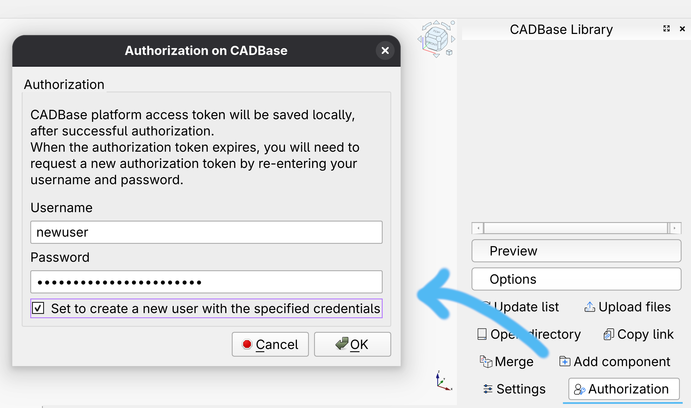
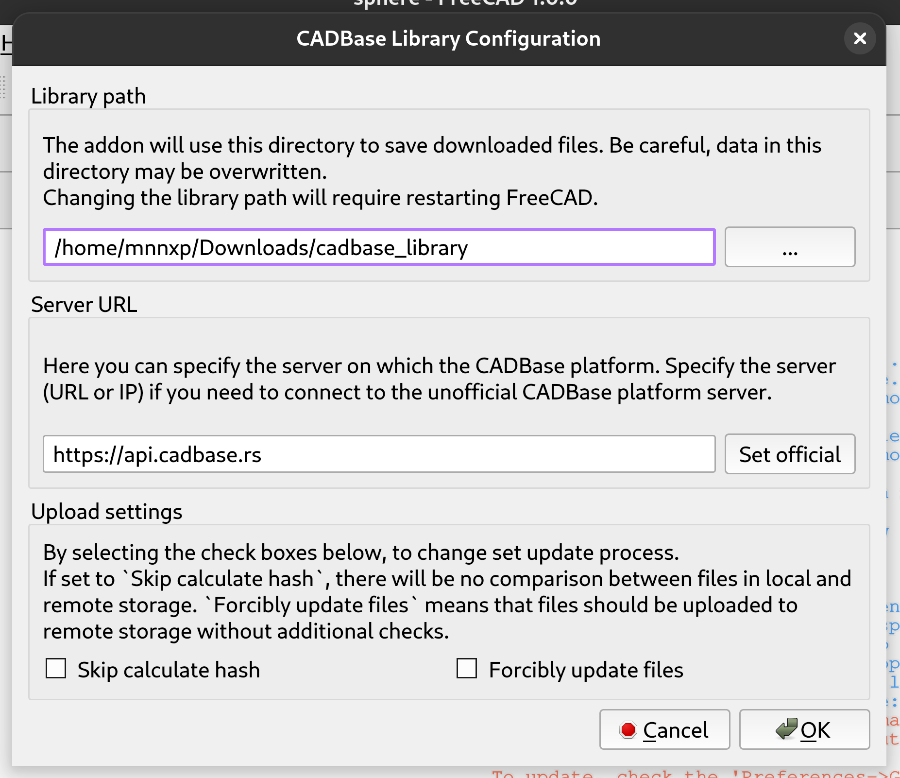
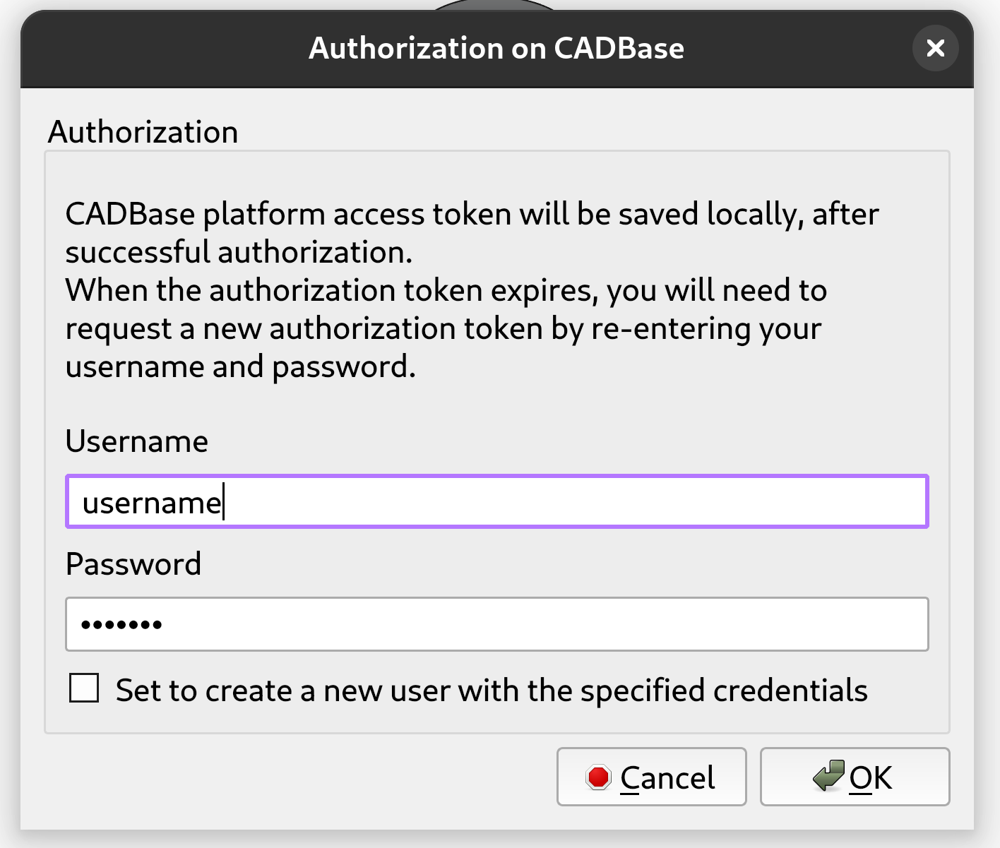
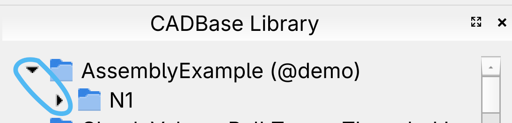
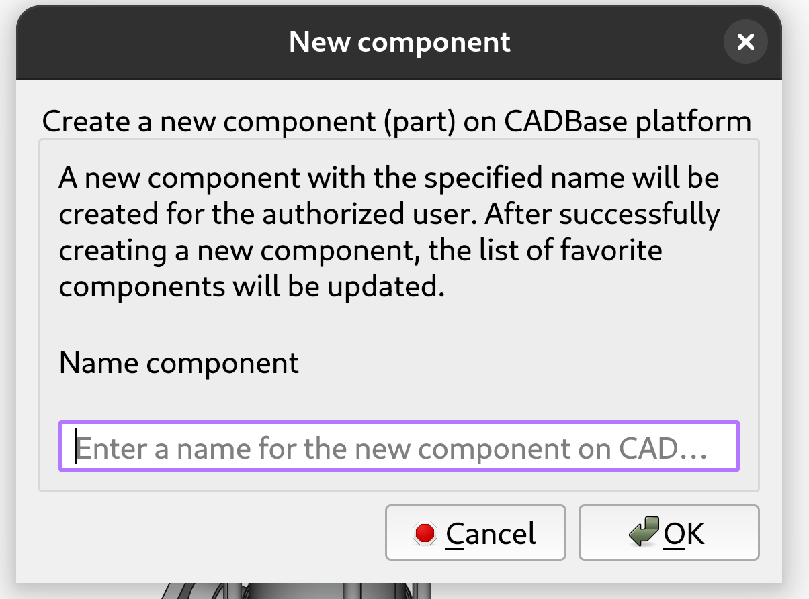
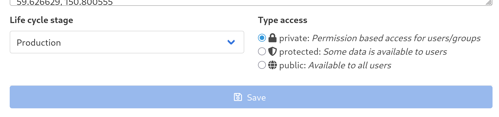
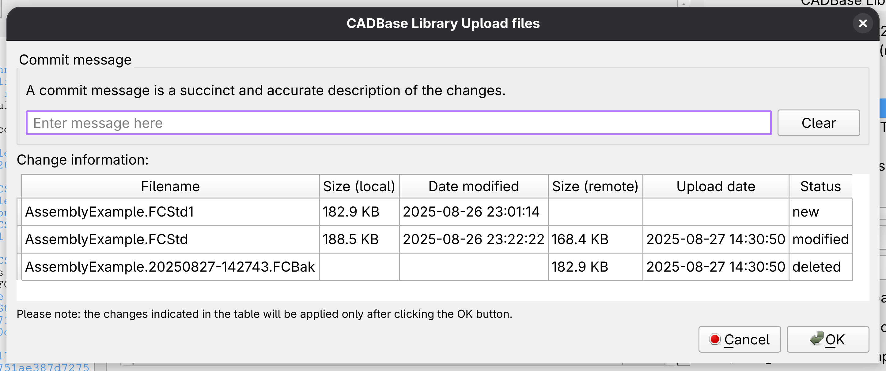
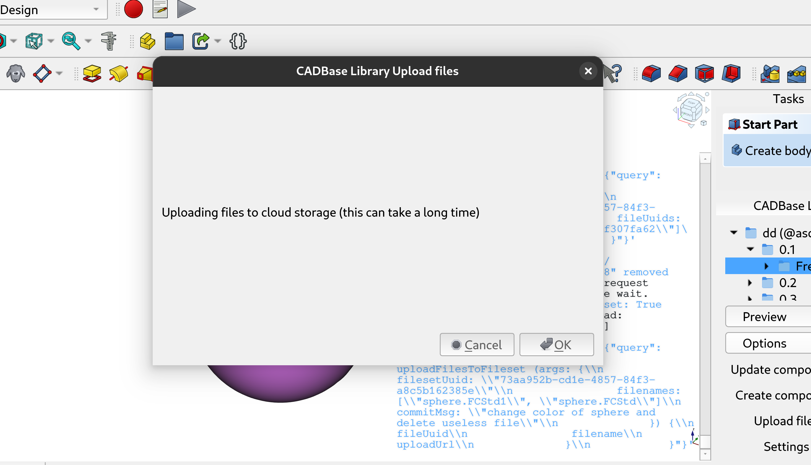

# CADBaseLibrary Workbench for FreeCAD

[](https://www.gnu.org/licenses/lgpl-3.0)
[](https://www.freecad.org)

This workbench enables users to upload and download parts from CADBase directly within the FreeCAD interface.

CADBase is a platform for publishing and sharing information about components, 3D models, drawings and manufacturers.

**Important Note:**  To use the workbench, you must have an account on the [CADBase Platform](https://cadbase.rs). You can also create an account via workbench, if the entered username is free, a new user will be created with the specified username and password.



## Description

Seamlessly integrate betwen CADBase platform and FreeCAD.

The CADBaseLibrary workbench empowers FreeCAD users to effortlessly discover, manage, and utilize a public/private library of components hosted on CADBase — a platform for sharing 3D models, parts, and technical data. With this workbench, you can browse favorite components, synchronize modifications, and upload your own parts, streamlining your design process and fostering collaborative development.

Designed for flexibility, CADBaseLibrary transforms your FreeCAD environment into a collaborative hub for component sharing and management, accelerating your product development lifecycle.

<p align="center">
  
</p>

### Key Features  

 - Versioned File Handling: Easily upload new versions, revert to previous revisions, and review change histories for each file.
 - Easy Integration: Open, view and include components in your projects using the FreeCAD user interface.
 - Cloud Storage Synchronization: Upload and download files with hash comparison.
 - Component Creation & Sharing: Create new components on CADBase and share your designs with the community via FreeCAD.

### CADBase Library Browser

Favorite components are displayed at the root level. These levels correspond to folder locations in the directory specified in the **Library path** property.  
Files for the FreeCAD fileset are loaded via this workbench; files for other filesets are not loaded.

The data display is organized into three levels:

- **Root level (`rl`)**: Displays all local library components.
- **Component level (`cl`)**: Shows the list of modifications for the selected component.
- **File set level (`fl`)**: Displays files within a selected modification’s FreeCAD file set.

The folder for FreeCAD files in local storage is created automatically when files are uploaded, regardless of whether the modification exists on CADBase.

**Folder structure example:**

```plaintext
-Library path                       # set in workbench (rl)
├── Vertical Pump (@lookme)         # component folder (cl)
│   ├── N1                          # modification folder
│   │   ├── FreeCAD                 # FreeCAD fileset (fl)
│   │   │   ├── modification        # technical data file
│   │   │   ├── vertical Pump.FCStd # FreeCAD file
│   │   │   └── ...                   # other files
│   │   └── ...                       # other filesets
│   ├── ...                           # other modifications
│   └── component                     # technical data file
├── ...                               # other components
├── cadbase_file_2018.log             # logs and responses (optional)
└── cadbase_file_2018                 # technical data file
```

## Install

### Addon Manager (recommended)

CADBaseLibrary is available through the FreeCAD Addon Manager:

It is called "CADBase Library" in the Addon Repository.

In menu **Tools** select **Addon Manager**, select the **Workbenches** tab find "CADBase Library" in the list and click Install.

**Important Note:** CADBaseLibrary Workbench needs FreeCAD v0.21 or above. Between FreeCAD versions 0.19 and 0.20, users can try using the CADBaseLibrary Macro version 0.2.0 [GitLab](https://gitlab.com/cadbase/cadbaselibrary-freecad/-/tree/c5f0aa061a3003c014d1876a967aa42f350f6343). CADBaseLibrary is **not** compatible with FreeCAD v0.18 and before.

### Manual Installation

It is also possible to install this workbench manually into FreeCAD's local Mod directory. This can be useful for testing local changes to the workbench, or to remove an old stale version of the workbench.

In this case, download the Github [cadbaselibrary-freecad-master.zip](https://github.com/mnnxp/cadbaselibrary-freecad/archive/master.zip) archive from [github.com/mnnxp/cadbaselibrary-freecad](https://github.com/mnnxp/cadbaselibrary-freecad) (see [Links](#Links) for more) to a temporary directory, and extract the Zip archive. Delete (or move) the **CadbaseLibrary** directory from the local FreeCAD Mod directory, if it exists. Then copy all items in the **cadbaselibrary-freecad** folder to the **CadbaseLibrary** folder in the directory containing all FreeCAD workbenches:

* for Windows: `C:\Users\******\AppData\Roaming\FreeCAD\Mod`
* for MacOS: `~/Library/Preferences/FreeCAD/Mod/`
* for Linux: `~/.local/share/FreeCAD/Mod/`

Below is a method for those who like to install manually, but in a shorter way:
```sh
# Example for the Linux platform and FreeCAD versions above v0.21
git clone https://gitlab.com/cadbase/cadbaselibrary-freecad.git \
~/.local/share/FreeCAD/Mod/CadbaseLibrary/
```

**Please Note:** You can see the current mod folder path through the Python console in FreeCAD. The method is described in the [Additional Information](#freecad-modules-and-macros-folders).

### Dependencies

The workbench does not require any external dependencies.

### First start

After it is installed and restart FreeCAD, the workbench will be available in the workbench drop-down list.

Select the **CADBase Library** workbench from the workbench drop-down list.

On first run, select the location of your library. The CADBase cloud storage will be synchronized with this location, and technical files for the workbench will be created there.

This location can be changed in the workbench settings in the field "Library path".

#### Setting up the Workbench

In the "CADBase library" window, on the **Options** tab, click the **Settings** button for open "CADBase library configuration".

###### Library path

Specify the local library location in the **Library path** field. When you change the location, the existing data in the previous location will not be moved automatically; you will need to move it manually if desired.  
Change to the path will only take effect after restarting FreeCAD.

###### Server URL

In the **Server URL** section you can set URL/IP for communication with the platform.

###### Upload settings

The **Upload settings** section allows you to configure parameters to improve the workbench’s performance, enable or disable file compare via hash, and force file updates to the remote storage.

- **Skip calculate hash:** If this option is enabled, files will not be compared using hashes; this is useful for skipping updates of existing files in remote storage.
- **Forcibly update files:** When enabled, hash compare is skipped, and files are uploaded in all cases.

The parameters affect only the uploading of data to remote (cloud) storage. When downloading data, existing files will not be overwritten regardless of the settings.

<p align="center">
  
</p>

#### Getting an authorization token

To specify **username** and **password** to access CADBase, you need to click on the **Authorization** button to open the "Authorization on CADBase" window.

To obtain a token for an existing account or create a new account to access CADBase, you must provide a username and password. After entering these data to receive the token need pressing the **OK** button.  
Please wait until you receive the token. This data will be saved and available after restarting FreeCAD.

**Important Note:**  If the access token has expired, you need to repeat these two steps (username and password are already saved):
1. Click on the **Authorization** button
1. Click on the **Ok** button

<p align="center">
  
</p>

## Control Buttons

- **Update list:** Retrieve data from the remote platform, updating the local and navigation view.
- **Upload files:** Open a window to upload local files to CADBase.
- **Open directory:** Open the folder containing the selected file/directory in your system’s file explorer.
- **Copy link:** Copy the URL of a selected component to the clipboard.
- **Merge:** Imports a copy of the selected file into the current document (no link). Supports STEP, BRP, BREP, and FCStd files.
- **Add component:** Create a new component via a modal dialog.
- **Settings:** Configure the local library path and CADBase server address.
- **Authorization:** Enter login credentials to generate or refresh the access token.

## Usage

Add target components to bookmarks (favorites) on the platform's website.

In FreeCAD will only display components that the user has bookmarked on CADBase, as well as those that have been previously downloaded.

The created components are automatically added to your favorites. You can remove them from your favorites via the platform's website.

### Getting data

Clicking **Update list** only updates the list of components from bookmarks active user, without downloading component modifications and files.

Double-clicking on a components folder to get a list of modifications for component.

Getting files of a file set for FreeCAD occurs after double-clicking on a modification folder.

**Note:**  If you don't need to sync with remote storage, but want to see the contents of a folder, please click on the arrow next to the folder instead of directly clicking on it. This will allow you to view local data without needing to request and download remote data.

<p align="center">
  
</p>

### Create Components

Use **Add component** to create a new component (part, project, etc.) on CADBase.  
This opens a modal window for entering the component name.

<p align="center">
  
</p>

By default, components have private access, which means that only the creator has access to them. To make a component publicly accessible, you need to change the access type to `public`.

You can do this by going to the component settings on the CADBase platform and changing the component `Type access` from `private` to `public`. This will allow other users to see the component.

<p align="center">
  
</p>

### Sending data

Select the modification from which you want to load the files. You can select either the modification folder or the FreeCAD file set folder. In the first case the workbench will define the FreeCAD file set itself. Only files from FreeCAD file set will be loaded to CADBase storage.

Click the **Upload files** button to process data and display information about detected changes between local and remote storage. The local storage (library) is considered to be the reference storage.

The **Commit message** section can optionally contain a message that allows users to better understand what has changed in this update. The message will be associated with all files that were added or changed in this update and can be viewed on the platform's website.

You can also compare local and remote files before uploading.  
Affected files are listed with change types:
- `new`: Not on remote, will be uploaded
- `modified`: Will be updated
- `deleted`: Will be removed from remote

Click **Ok** to confirm upload.  
The progress will be shown in FreeCAD's report.

<p align="center">
  
</p>

Information about the download process will be displayed in the active window (widget) and log.

After the files are uploaded, the window (widget) will close and a message will appear in the log with information about the number of successfully uploaded files.

<p align="center">
  
</p>

## Additional Information

##### FreeCAD modules and macros folders

In FreeCAD's Python console, type or paste `App.getUserAppDataDir() + "Mod"` to get the path to the modules folder, and `App.getUserMacroDir()` to get the path to the macros folder. The console can be accessed via the **View > Panels** menu.

##### Used (reserved) names in the workbench

Please don't use `cadbase_file_2018` and `cadbase_file_2018.log` as file or folder names in the CADBase library folder. These files store server responses and logs, if you use these filenames for your data, you may lose them.  
If you need to save logs to a file (for example, for debugging, study, or other purposes), you need to create a `cadbase_file_2018.log` file in the local library folder.

A file named `component` is created within each component folder containing technical data about the component.

A file named `modification` is created within each modification folder containing technical data about the component modification.

##### How the workbench work with data

To avoid losing local data when downloading from CADBase storage (from the cloud), files already in local storage are skipped.

Before uploading files to CADBase storage (remote storage) the workbench can check for existing files in the remote storage and excludes files from the upload list if their local and remote storage hashes match.

When the `Forcibly update files` setting is enabled, remote files are updated regardless.

However, during download, files are always skipped if they already exist locally.

## Links

- CADBase Library Workbench: [Forum thread](https://forum.freecadweb.org/viewtopic.php?f=22&t=69389)
- Development repository: [GitLab](https://gitlab.com/cadbase/cadbaselibrary-freecad)
- Mirrors: [GitHub](https://github.com/mnnxp/cadbaselibrary-freecad), [Codeberg](https://codeberg.org/mnnxp/cadbaselibrary-freecad)
- About CADBase Platform: [Website](https://cadbase.rs/), [YouTube](https://www.youtube.com/@cadbaseplatform)

## Version

v3.0.0 2025-09-15    * The `blake3` library has been replaced with `hashlib`, and the hash algorithm is now SHA‑256, added buttons for opening local folders and copying component links, duplicated navigation buttons, added tooltips.

v2.0.0 2025-01-25    * Implemented preview of changes before sending update, added deletion of old files from remote storage, updated server API.

v1.0.3 2024-12-04    * Fixed URL link to README, corrected description, updated illustrations.

v1.0.2 2024-10-01    * Fixed compatibility with FreeCAD 1RC2 and added FreeCAD ID when creating a user.

v1.0.1 2024-06-05    * More functionality:
- Possibility to create an account (on CADBase platform) via workbench;
- Possibility to create a component (on CADBase platform) via workbench;
- Saving login and password for quick retrieval of a new token.

v1.0.0 2024-04-07    * Support for working with one local library from different programs.
Changes:
- In modifications, separate folders are created for FreeCAD file sets;
- Changed the folder naming for components, it now looks like "Component Name (@user-owner)";
- Authentication moved to a separate window;
- Corrected typos in the log and comments.

v0.3.0 2023-09-21    * Changed type add-on from macro to workbench.
Other changes:
- Fixed window name display;
- Disabled deletion of old versions of files;
- Added interface translation;
- Reversed order of release notes in the log.

v0.2.0 2023-02-02    * Added the ability to upload files to the CADBase storage. Added comparing local and cloud-stored files using Blake3 hash.

v0.1.3 2022-11-13    * Bugs fixed. Added check to skip a file if it already exists in local storage.

v0.1.2 2022-11-11    * Changed URLs for `Wiki` and `Web`, code split into files, updated interface: added descriptions for settings

v0.1.1 2022-10-15    * bugs fixed and code optimization

v0.1.0 2022-06-13    * first release
